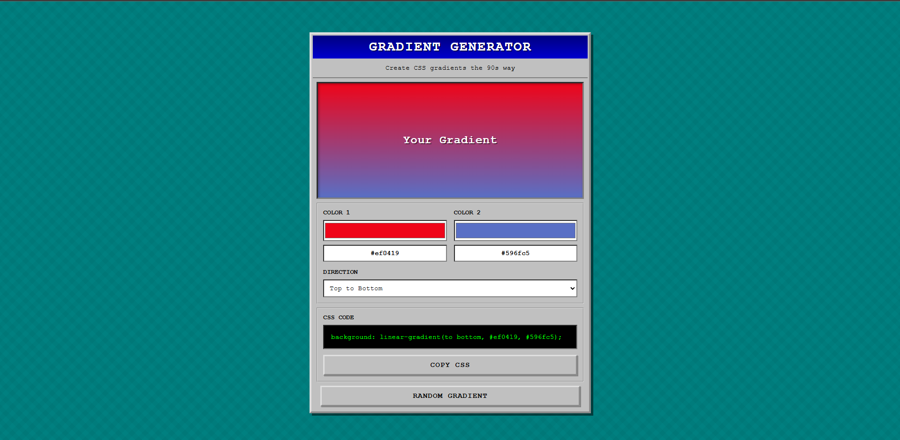

# Gradient Generator

A retro 90s-styled web tool for creating CSS gradients. Inspired by the Windows 95 era of web design with a nostalgic aesthetic.

## Features

- **Interactive Color Pickers**: Choose any two colors for your gradient
- **Multiple Directions**: Select from 9 different gradient directions including:
  - Linear gradients (horizontal, vertical, diagonal)
  - Radial gradients (circular)
- **Live Preview**: See your gradient in real-time as you adjust colors and directions
- **One-Click Copy**: Copy the generated CSS code to your clipboard instantly
- **Random Generator**: Get inspired with random gradient combinations
- **Responsive Design**: Works perfectly on desktop, tablet, and mobile devices
- **Retro UI**: Windows 95-inspired interface with classic buttons and borders

## How to Use

1. **Choose Colors**: Use the color pickers to select your two gradient colors
2. **Select Direction**: Pick your preferred gradient direction from the dropdown
3. **Preview**: See the gradient update in real-time in the preview box
4. **Copy Code**: Click the "COPY CSS" button to copy the CSS code
5. **Paste**: Use the gradient in your own projects

**Bonus**: Click the "RANDOM GRADIENT" button for instant creative inspiration

## Technologies Used

- **HTML5**: Structure and semantic markup
- **CSS3**: Modern styling with gradients, animations, and responsive design
- **JavaScript (Vanilla)**: Interactive functionality and clipboard API

## Screenshot

## Use Cases

- Web design projects
- UI/UX prototyping
- Social media graphics
- Background designs
- Learning CSS gradients
- Quick design inspiration

## Learning Outcomes

This project demonstrates:
- Working with the HTML5 Color Input
- CSS gradient properties (linear and radial)
- JavaScript DOM manipulation
- Clipboard API usage
- Event handling
- Responsive design principles
- Retro/nostalgic web design techniques

## License

Feel free to use this project for learning and personal projects.

---

Made for Hacktoberfest and the open-source community
