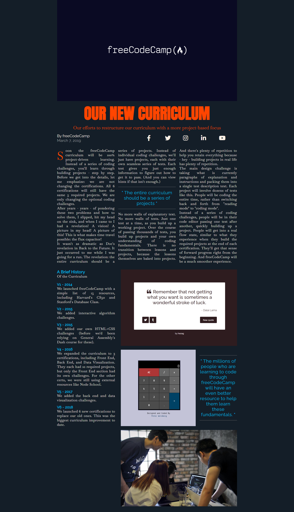
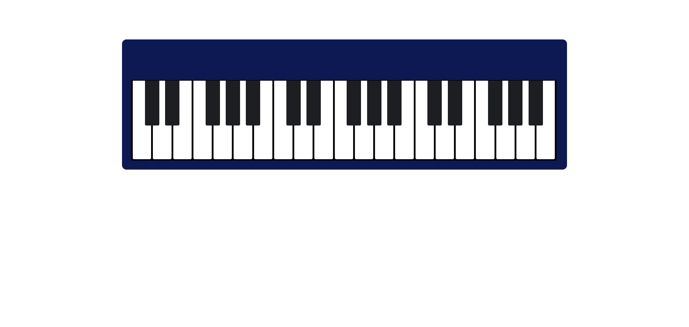
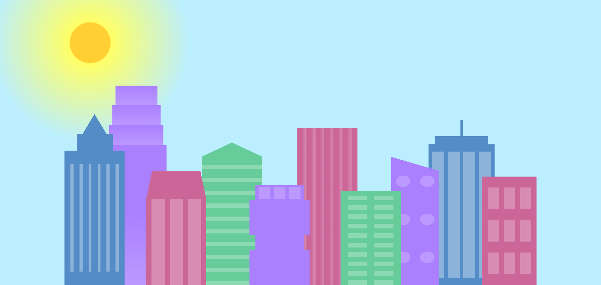

<h1 align="center">📁 HTML & CSS Projects</h1>

Welcome 🌸 to <b>HTML & CSS!</b> Project.

<h2>💻 Technologies Used</h2>

<h2>🖼️ Screenshot</h2>

<h3 align="center">Cat Painting</h3>

<h3 align="center">Flower Gallery</h3>

<h3 align="center">Food Menu</h3>

<h3 align="center">fCC Magazine</h3>

<h3 align="center">Piano</h3>

<h3 align="center">Registration Form</h3>

<h3 align="center">Skyline</h3>

 

> _Create with 🧡!_ 