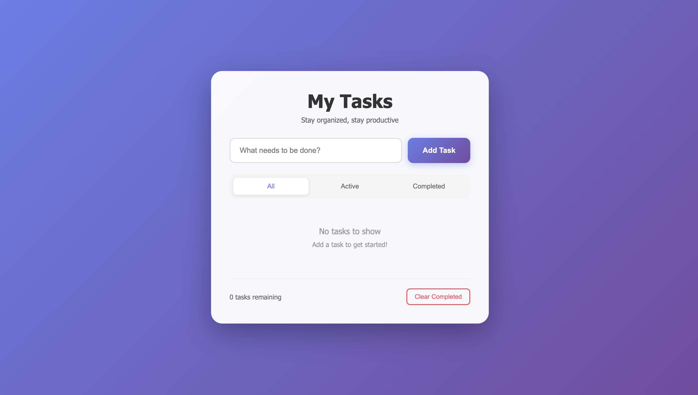

# Modern Todo List App

A beautiful and functional todo list application built with vanilla HTML, CSS, and JavaScript. Features a modern design with smooth animations and an intuitive user interface.

## Features

- ✅ Add, complete, and delete tasks
- 🎯 Filter tasks by status (All, Active, Completed)
- 🧹 Clear all completed tasks at once
- 📊 Track remaining active tasks
- 🎨 Modern gradient design with smooth animations
- 📱 Fully responsive for mobile and desktop
- ⚡ Fast and lightweight - no frameworks required

## Installation

1. Clone or download this repository
2. Make sure all three files are in the same folder:
   - `index.html`
   - `style.css`
   - `script.js`
3. Open `index.html` in your web browser

No build process or dependencies required!

## Usage

### Adding Tasks
- Type your task in the input field
- Click the "Add Task" button or press Enter

### Completing Tasks
- Click the circular checkbox next to a task to mark it as complete
- Click again to mark it as active

### Deleting Tasks
- Hover over a task to reveal the "Delete" button
- Click "Delete" to remove the task

### Filtering Tasks
- Use the filter buttons to view:
  - **All**: Show all tasks
  - **Active**: Show only incomplete tasks
  - **Completed**: Show only completed tasks

### Clearing Completed Tasks
- Click the "Clear Completed" button at the bottom to remove all completed tasks at once

## File Structure

```
todo-app/
│
├── index.html          # Main HTML structure
├── style.css           # Styling and animations
├── script.js           # Application logic
└── README.md           # Documentation
```

## Technologies Used

- **HTML5** - Semantic markup
- **CSS3** - Modern styling with gradients, animations, and flexbox
- **JavaScript (ES6+)** - Vanilla JS for functionality

## Browser Compatibility

Works on all modern browsers:
- Chrome
- Firefox
- Safari
- Edge

## Customization

You can easily customize the app by modifying:
- **Colors**: Edit the gradient values in `style.css`
- **Fonts**: Change the font-family in the `body` selector
- **Animations**: Adjust animation durations and effects in CSS

## License

Free to use for personal and commercial projects.

## Author

Created with ❤️ by Claude

---

Enjoy staying organized! 📝



