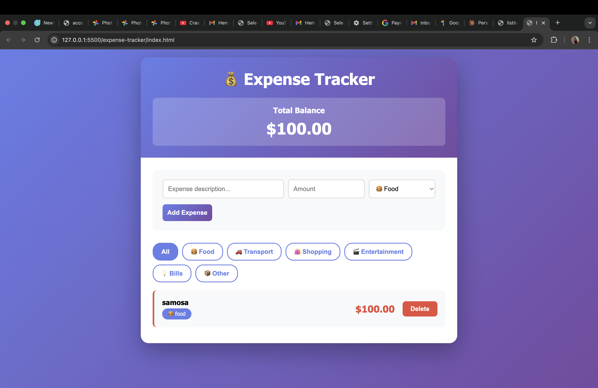

# 💰 Expense Tracker App

A sleek, **modern expense tracking application** with a beautiful gradient UI, built entirely with **vanilla HTML, CSS, and JavaScript**.  
It features **persistent localStorage**, category filtering, and a **smooth, animated interface** designed for effortless expense management.

---

## 📸 Preview


*A beautiful, gradient-themed expense tracker with real-time balance tracking and category filtering.*

---

## ✨ Features
- **Add & Delete Expenses**: Quickly track your daily spending with a simple, intuitive interface.
- **Persistent Storage**: All data saved automatically using **localStorage** – survives page refreshes!
- **Category Filtering**: Organize expenses into 6 categories (Food, Transport, Shopping, Entertainment, Bills, Other).
- **Real-Time Balance**: Instantly see your total expenses updated with every transaction.
- **Color-Coded Categories**: Visual borders for easy identification of expense types.
- **Responsive Design**: Works perfectly on desktop, tablet, and mobile devices.
- **Keyboard Support**: Press **Enter** to quickly add expenses without clicking.
- **Zero Dependencies**: Pure vanilla JavaScript – no frameworks, no npm, no build process!

---

## 🛠 Tech Stack
- **HTML** → Clean, semantic structure and layout.
- **CSS** → Modern styling with gradients, animations, Flexbox & Grid, responsive design.
- **JavaScript (ES6+)** → Application logic, DOM manipulation, and localStorage handling.

---

## 🚀 How to Use
1. Download or clone all three files: `index.html`, `style.css`, and `script.js`.
2. Place them in the same folder.
3. Open `index.html` in any modern web browser.
4. **No installation required** – just double-click and start tracking!

---

## 📁 File Structure
```
expense-tracker/
├── index.html          # Main HTML structure
├── style.css           # All styling and animations
├── script.js           # Application logic and localStorage
└── README.md           # Project documentation
```

---

## 💡 Usage Tips
- **Add Expense**: Fill description, amount, category → Click "Add Expense" or press Enter
- **Filter**: Click any category button to filter expenses, "All" to view everything
- **Delete**: Click "Delete" button next to any expense (confirmation required)
- **Total Balance**: Automatically updates at the top of the page

---

## 🔒 Privacy
- **100% Local Storage** – All data stays in your browser
- **No Server Requests** – Works completely offline
- **No Tracking** – Zero analytics or external scripts